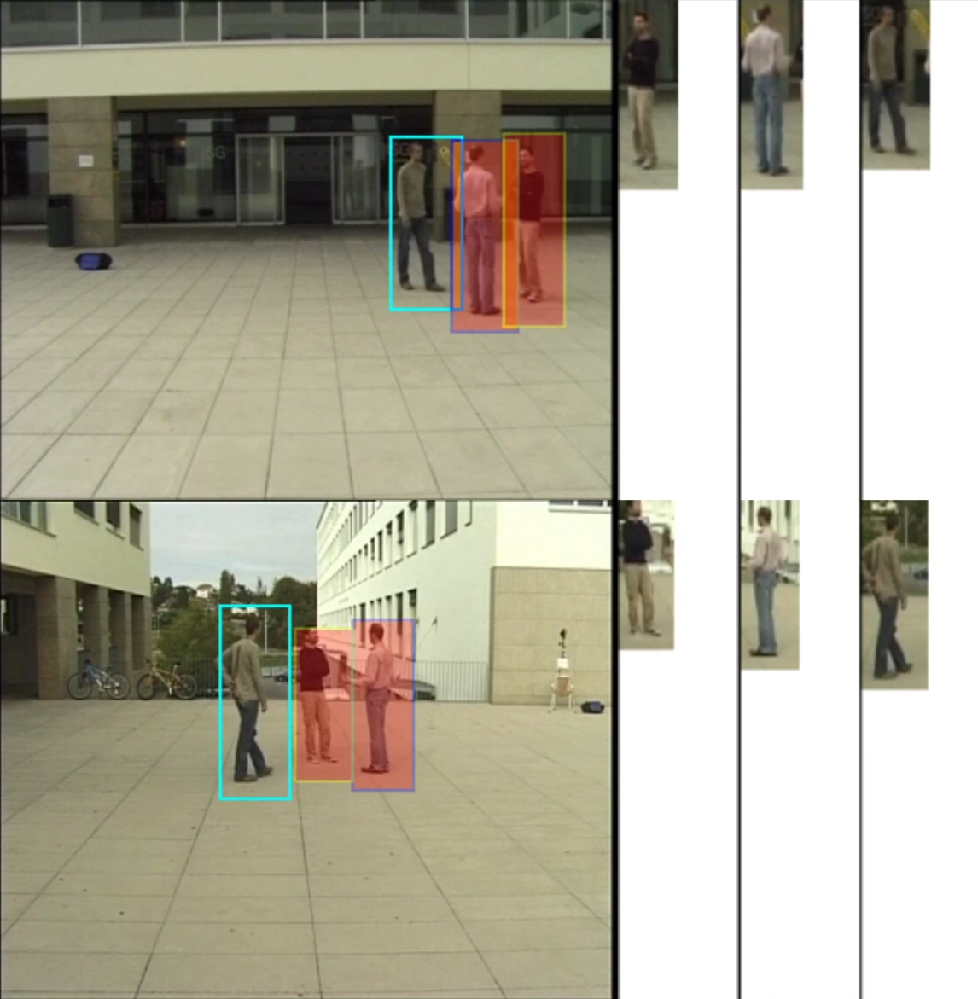

# REIDCoronaHackathon

A web interface for detection of prolonged interactions.
## Tech Stack:
* [torchereid](https://github.com/KaiyangZhou/deep-person-reid)
* [Faster R-CNN](https://github.com/jwyang/faster-rcnn.pytorch)
* Django
* [paper.js](https://github.com/paperjs/paper.js)

## [Video demo](https://www.youtube.com/watch?v=nv4rgsmGKDw)

## Presentation (Ukrainian)
* [Interactive version](https://prezi.com/p/xarcs2qkqipt)
* [PDF version](presentation.pdf)
